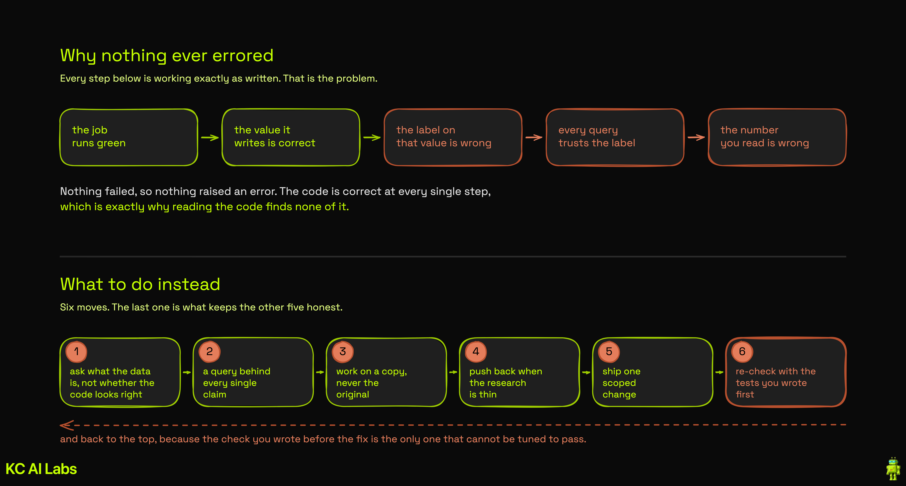
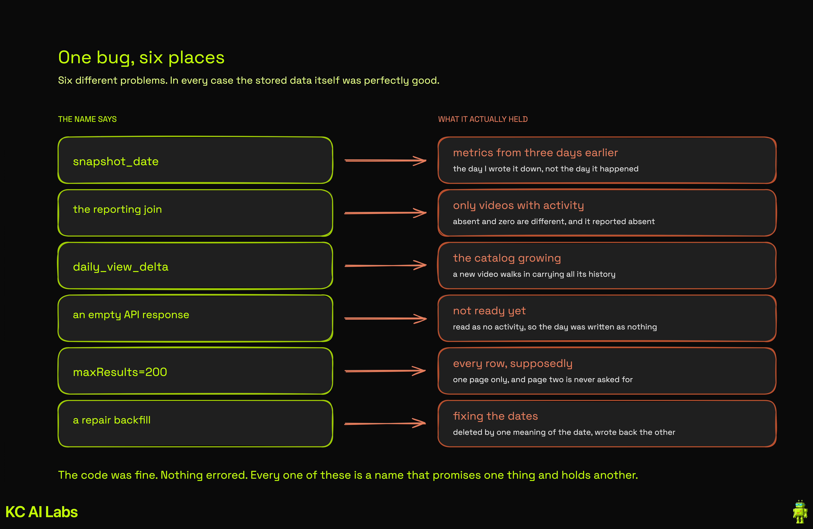

# Auditing your own data with AI

This pipeline ran green every morning for months and was quietly wrong the whole time. Nothing
errored. No alert fired. The numbers were just not what they claimed to be.

I found it by accident, asking an AI agent about my channel's performance and having it tell me the
numbers underneath the question did not look right. This document is what came out of fixing it:
the prompt, the standing rules, and the five things worth taking with you.

Everything here is method rather than configuration, so it should transfer to any warehouse and most
pipelines.

---

## Five takeaways

**1. Reviewing your code and interrogating your data are different questions.**
Pointing AI at this repository weeks earlier returned a sensible list of engineering improvements and
not one of the wrong numbers. Reading code tells you whether the code looks right; only querying the
data tells you whether the numbers are.

**2. A finding you have not reproduced yourself is still just a claim.**
The checks worth trusting at the end were the ones written before the fix existed, because those
cannot be tuned toward it. Watch for the zero that means "this rule found no exceptions" rather than
"there are none": my own duplicate check found 42 when there were 63, because a filter I had not
questioned was hiding rows.

**3. Operate on production data safely.**
Copy before anything writes, and verify by counting both sides rather than trusting that the job
reported success. The copy is itself a production write, so it needs the same approval as the change
it is protecting you from.

**4. Expect to find more than you went looking for, and push on research depth.**
The audit found six problems, and fixing them surfaced a seventh nobody had predicted. The planned
pagination fix then turned out to be wrong, because `startIndex` quietly returns zero rows with an
HTTP 200, and getting to the real answer took sending the agent back after it read two web pages and
stopped.

**5. Scope it tight and stay inside the scope.**
Data work hands you things you did not go looking for, so an unscoped session grows faster than you
can follow it. Write the good ideas down for another day, ship the one you started, and keep the
commits small enough that reversing a decision means reversing one thing.



---

## Making a safe copy, for takeaway 3

Most warehouses already do this natively, and it is worth checking what you have before reaching for
anything new: Snowflake zero-copy clones, BigQuery table snapshots, and Delta and Iceberg time travel
all hand you a production-shaped copy for roughly the cost of the metadata.

Beyond that there is a category of git-for-data tooling, all built on separating metadata from data
so a branch costs pointers rather than a full copy:

| Tool | Where it fits |
|---|---|
| [lakeFS](https://lakefs.io) | branching and commits over object storage data lakes |
| [Project Nessie](https://projectnessie.org) | git-like versioning for Apache Iceberg catalogs |
| [Dolt](https://www.dolthub.com) | a relational database with branch, diff and merge on tables |
| [Neon](https://neon.com) | branching for Postgres |
| [Bauplan](https://www.bauplanlabs.com) | branching and rollback for lakehouse pipelines |

I have had one of Bauplan's cofounders on this channel, so treat that one as a mention rather than an
impartial recommendation. I have no relationship with the others.

---

## The audit prompt

This is not a transcript of what I typed. The audit was a conversation across many turns, so what
follows is the distilled version of it, generalized to run against your data rather than mine.

Paste it into an agent that has **both** your pipeline repo and your warehouse reachable, whether
through an MCP server, a CLI it can run, or a notebook it can execute. One bracketed part to replace.

> You have access to this data pipeline repo and to its warehouse. If you have questions about the
> data or connecting to it, please let me know.
>
> Audit the state of this data for quality problems. What I want to know is whether the numbers this
> pipeline produces can be trusted, and where they cannot.
>
> Look at all of it: the pipeline code, the tables themselves, the date columns, the joins in the
> queries that read it back, and the extracts that load it. Things like a column whose name does not
> match what it holds, a join that drops rows instead of returning zeros, gaps in something meant to
> be continuous, the same event stored twice under different keys, an extract that truncates as the
> source grows, or history that changed after it was collected. Those are examples, not the list.
> Look for whatever else is actually there.
>
> How you work matters as much as what you find:
>
> - Read-only throughout. Read-only statements in the warehouse, GET requests against any source
>   system. Do not modify, delete or backfill anything, and do not propose a fix until I have seen
>   the findings.
> - Every claim comes with the query that proves it and the real numbers it returned. A finding
>   without a query is a hypothesis.
> - Work out what a column means by reading the code that writes it, not by trusting its name. If
>   the writer lives outside this repo, read the loader's configuration and a raw source payload.
> - Documentation tells you intent. Where behavior matters, probe it and tell me what you observed.
>   [link your source system's docs here]
> - If a check comes back clean, tell me the rule you tested and what a violation would have looked
>   like. A clean result with no stated rule does not count as a clean result.
> - Say when you cannot verify something rather than inferring it. Warehouse queries only show you
>   what arrived, never what was dropped on the way in.
> - If a result would expose personal data, give me aggregates, suppress groups small enough to
>   identify someone, and ask before returning identifiers or individual rows.

If it comes back with generic advice instead of findings, reply: **"You have not run a single query
yet. Run them."**

---

## Building it into your agent

The prompt above is a one-off. This block is the durable version: add it to your `CLAUDE.md`,
`AGENTS.md`, or whichever instruction file your agent reads, so this is the default posture on data
work rather than something you have to remember to ask for.

```markdown
## Working with data

- **Back every claim with the query and its real output.** Where measurement is not possible, reason and say that is what you did. A warehouse query only ever shows what arrived, never what was dropped on the way in, so completeness needs the extract code and the source. Inference is fine. Inference dressed as measurement is not.

- **Check what produced something before trusting what it is called.** Names and documentation describe intent; the writing code and the live behavior describe what is true. The same applies to your own answers: tell me what you actually consulted, because a thin answer labelled thin is more useful to me than a confident one built on two pages.

- **A clean result only means the rule you used found nothing.** State the rule next to the result so I can judge whether it could have caught anything. Where a check already exists from before the change, prefer it to one you write afterwards.

- **Investigate read-only.** When I do ask for a change, get approval for the write itself, treat a backup as preparation rather than permission, and never drop the original until the replacement exists and both sides have been counted.

- **The plan is a hypothesis.** Tell me where the work departed from it and why. Do not widen the scope to chase what you find along the way; anything new gets its own pass.
```

---

## What this found here

For the record, run against this repo and its warehouse:

| | |
|---|---|
| One date column meaning two different things | across four date ranges, not one boundary |
| Rows double counted | 237, in two tables |
| Days of history destroyed by an earlier repair job | 3 |
| Days never collected | 4 |
| Days recovered | 7 |
| Days still missing after the fix | 2, both genuinely zero-activity |



Every one of those is the same mistake: a name that promises one thing while the contents are
something else, and in every case the contents themselves were perfectly good data.

The second AI mattered too. The conclusions here went past a different model for adversarial review,
and several first-pass conclusions did not survive it, including one root cause that a single live
probe disproved outright.
