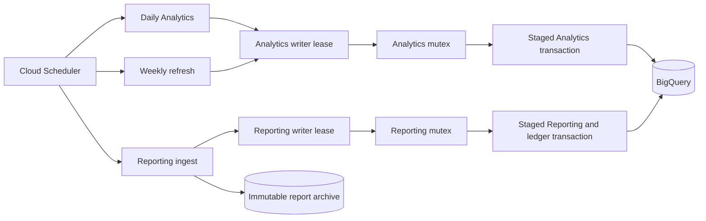

# YouTube BigQuery Pipeline

Automated pipeline that lands a YouTube channel's analytics in BigQuery for trend analysis: a nightly snapshot from the Data and Analytics APIs, plus every bulk report the Reporting API produces, with twelve views on top for the growth questions YouTube Studio only shows as charts. Built for the [KC Labs AI](https://www.youtube.com/@kylechalmersdataai) channel; nothing in it is tied to that channel.

> Built live on YouTube: **"I Let Claude Code Build My Entire YouTube Analytics Pipeline"** (build prompt in `PROMPT.md`, plan in `prompts/completed/`). Audited and repaired in **"I Audited the BigQuery Pipeline Claude Code Built Me. It Was Wrong."**: prompt, standing rules and takeaways in [AUDITING-YOUR-DATA-WITH-AI.md](AUDITING-YOUR-DATA-WITH-AI.md), findings in [docs/pipeline-audit-2026-08.md](docs/pipeline-audit-2026-08.md). Hardened and extended with the Reporting API in a third session, recorded as well: takeaways in [docs/hardening-session-takeaways.md](docs/hardening-session-takeaways.md).

OAuth verification pages: [YouTube Analytics Pipeline](https://kyle-chalmers.github.io/youtube-bigquery-pipeline/), [Privacy Policy](https://kyle-chalmers.github.io/youtube-bigquery-pipeline/privacy.html), [Terms of Service](https://kyle-chalmers.github.io/youtube-bigquery-pipeline/terms.html).

**Running it for your own channel:** [docs/adopt-for-your-channel.md](docs/adopt-for-your-channel.md) has the order of steps, what to change, the traps found during the build, and a prompt you can paste into a coding agent to do the adaptation with you.

---

## Architecture



Staging has the same shape with a separate dataset, lock bucket, functions, Scheduler jobs, and alert filters.

Three Cloud Functions (2nd gen, Python 3.11) built from one source directory, each with its own Cloud Scheduler job:

- **`youtube-bigquery-pipeline`**, nightly at 00:10 Phoenix (ten minutes after the Data API quota resets). Fetches the video catalogue and public counters from the Data API, and per-video metrics and traffic sources for the configured activity day. It stages each replacement and commits it in one BigQuery transaction after validating the returned rows.
- **`youtube-reporting-ingest`**, 08:00 and 14:00 Phoenix. Lists every report YouTube still retains for the channel's 19 Reporting API jobs, compares with a ledger, archives each new file to Cloud Storage, parses by header name, and replaces that day's partition and ledger state in one BigQuery transaction. The transaction validates the expected date, channel, native grain, row count, and report generation. A header-only report never deletes a populated day. `REPORTING_ENABLED` is a kill switch.
- **`youtube-analytics-refresh`**, weekly on Sundays at 03:00 Phoenix. Re-fetches the trailing activity window and transactionally replaces `daily_video_analytics` and `daily_traffic_sources`, archiving the previous rows first. Traffic sources use one range query for the whole window instead of one call per video per day.

Every writer first acquires an environment-specific Cloud Storage lease and then updates the singleton `analytics` or `reporting` BigQuery mutex inside its replacement transaction. The lease blocks overlapping invocations before staging begins. The mutex protects the final partition replacement. Staging and production use separate lock buckets.

Secrets (API key, OAuth client, refresh token) live in Secret Manager. One refresh token with the `yt-analytics.readonly` scope serves both the Analytics and the Reporting API, so the channel account and the cloud project can be different Google accounts. Resource use is small, but the six-job staging and production Scheduler topology exceeds the three-job monthly free allowance.

## Why three YouTube APIs

| | [Data API v3](https://developers.google.com/youtube/v3) | [Analytics API v2](https://developers.google.com/youtube/analytics) | [Reporting API v1](https://developers.google.com/youtube/reporting) |
|--|--|--|--|
| Gives you | Public counters and metadata | Per-day watch time, traffic sources, subscriber changes, by query | Bulk daily CSVs at native grain: impressions and CTR, engaged views, traffic detail (search terms, suggesting videos), devices, playback locations, demographics, cards, end screens, sharing, playlists |
| Auth | API key | OAuth2 | OAuth2, same scope |
| Shape | Cumulative totals | Per-day activity, answered on demand | Per-day files; a day can be regenerated later with corrections, and only the newest file is authoritative |
| Catch | Shared per-project quota | Nothing for the most recent three days; no impressions | Files expire 60 days after generation; a new job backfills only 30 days |

The Reporting API is the only public source of impressions, CTR and engaged views, and the only way to get what YouTube Studio shows. Its retention rule is why the ingest archives every file before parsing it and why the jobs were created before the loader was written.

---

## Prerequisites

`gcloud` (with `bq`), Python 3.11+, `git`, a Google Cloud project with billing enabled, and the Google account that owns the channel. Log in once with `gcloud auth login` (CLIs) and `gcloud auth application-default login` (the Python scripts); both expire and both are needed.

Configuration is environment variables; `.env.example` lists them all, including the environment-specific `PIPELINE_LOCK_BUCKET`, `RUN_LEASE_TTL_SECONDS`, and Reporting work budget. Copy it to `.env` and never commit it. Owner-specific notes go in `.internal/` (gitignored).

---

## Deployment

Each script is idempotent. Run them in this order; the reasons are in the adoption guide.

| Step | Command | Notes |
|---|---|---|
| 1 | `bash setup/1_enable_apis.sh` | Cloud Functions, Run, Build, Scheduler, Secret Manager, Storage, and the YouTube Analytics and Reporting APIs. BigQuery and the YouTube Data API are expected to be enabled already |
| 2 | `bash setup/2_create_bigquery.sh` | Dataset, the 4 original tables, the 19 Reporting tables and the ledger (`CREATE TABLE IF NOT EXISTS`; Reporting DDL is generated from `report_specs.py`, do not hand-edit) |
| 3 | `bash setup/3_setup_oauth.sh`, then `python3 setup/oauth_helper.py` | One-time consent as the channel owner; stores the refresh token and client credentials in Secret Manager. Add the channel account as a test user if it differs from the project account |
| 4 | `gcloud secrets create youtube-data-api-key --data-file=-` | The Data API key, from stdin, never from a file left on disk |
| 5 | `python3 setup/7_create_reporting_jobs.py --create`, then `python3 setup/archive_reporting_raw.py --verify` | Do this early: jobs start a 30-day backfill and files expire. Dry run without `--create` |
| 6 | `bash setup/8_create_staging.sh` | Creates `youtube_analytics_staging` seeded from production, including its preseeded writer mutex rows |
| 7 | `PIPELINE_LOCK_BUCKET="${GCP_PROJECT}-youtube-pipeline-locks-staging" bash setup/13_setup_run_locks.sh`, then repeat with a distinct `...-prod` bucket | Creates isolated lock buckets with uniform bucket-level access, public access prevention, and bucket-scoped `roles/storage.objectUser` |
| 8 | Deploy all three writers to staging | Set each staging function name, `BQ_DATASET=youtube_analytics_staging`, and the staging lock bucket. The deploy scripts refuse production and staging crosses |
| 9 | `PIPELINE_LOCK_BUCKET=... bash setup/4_deploy_function.sh` | Deploys the daily function with staged transactional writes, one maximum instance, and the Analytics writer lease |
| 10 | `REPORTING_ENABLED=false PIPELINE_LOCK_BUCKET=... bash setup/9_deploy_reporting_function.sh`, backfill, then deploy with `REPORTING_ENABLED=true` | Deploys Reporting with a 1,500-second timeout, 1,200-second work budget, one maximum instance, and the Reporting writer lease. Production requires an explicit kill-switch value |
| 11 | `REFRESH_TIMEOUT=... ANALYTICS_LOOKBACK_DAYS=... PIPELINE_LOCK_BUCKET=... bash setup/12_deploy_refresh_function.sh` | Time a real staging run first. The refresh uses the Analytics writer lease and the same transactional partition replacement as the daily writer |
| 12 | `bash setup/5_create_scheduler.sh` for each function; `ALERT_EMAIL=... bash setup/6_setup_monitoring.sh` | Configure explicit job IDs, deadlines, retry policies, target services, and `ERROR` alert severity. Reporting uses a 1,800-second Scheduler deadline and zero retries |
| 13 | `BQ_DATASET=youtube_analytics bash setup/10_create_views.sh` | Creates the twelve views; views hold no data |

IAM for the function's service account: `cloudbuild.builds.builder`, `secretmanager.secretAccessor`, `bigquery.dataEditor`, and `bigquery.jobUser`. Reporting also receives `storage.objectCreator` plus `storage.objectViewer` on the archive bucket. Writers receive `storage.objectUser` on their environment's lock bucket only.

---

## Verification

Offline tests run on every push. The staging remediation verifier exercises lease contention, mutex refusal, concurrent transactions, rollback, repair, and alert scoping against staging resources. The read-only production proof pack is generated from the same report specification as the Reporting DDL.

```bash
python3 -m pytest tests/ -q                                   # offline, no credentials
bash scripts/verify_parity.sh                                 # staging (new code) vs prod (running code), same day, by business key
bash scripts/verify_reporting.sh youtube_analytics            # grain, one report per day, ledger matches tables, cross-source reconciliation
bash scripts/verify_views.sh youtube_analytics                # grain, no fan-out, ratios recomputed, calendar windows, Studio spot-check rows
PIPELINE_LOCK_BUCKET=... bash scripts/verify_remediation_staging.sh  # destructive staging-only concurrency and repair rehearsal
```

`sql/verification/production_proof.sql` contains the complete read-only production proof pack with project, dataset, and affected-date placeholders. `sql/verification/prod_inventory.sql` lists every object and every write to the original tables. `docs/studio-comparison.md` says which YouTube Studio number to compare to which column and what will not match: Studio's counters keep moving after a report is generated, YouTube issues a replacement file only sometimes, and average view duration in Studio is watch time over *engaged* views.

To trigger a function by hand:

```bash
URL=$(gcloud functions describe youtube-bigquery-pipeline --region=us-central1 --gen2 --format='value(serviceConfig.uri)')
curl -s -H "Authorization: bearer $(gcloud auth print-identity-token)" "$URL" | python3 -m json.tool
```

### Expired lease recovery

An expired lease fails closed and requires an operator check. Pause the matching Scheduler job, confirm that no Cloud Run request or manual writer is active, then inspect the exact lease record:

```bash
.venv/bin/python setup/manage_run_lease.py status \
  --bucket "$PIPELINE_LOCK_BUCKET" --dataset "$BQ_DATASET" --domain reporting-writer
```

Clear only an expired lease by passing the generation returned by the fresh status command. The tool refuses a live lease, a changed generation, or a mismatched dataset confirmation.

```bash
.venv/bin/python setup/manage_run_lease.py clear \
  --bucket "$PIPELINE_LOCK_BUCKET" --dataset "$BQ_DATASET" --domain reporting-writer \
  --generation GENERATION --confirm-dataset "$BQ_DATASET" --confirm-no-active-writer
```

Use `analytics-writer` for the daily, refresh, Analytics backfill, and Analytics repair domain. Resume the Scheduler only after both the lease check and the relevant warehouse verifier pass.

---

## BigQuery schema

Dataset `youtube_analytics`. Days are Pacific-time days everywhere (`activity_date`, `report_date`); `snapshot_date` is the local calendar day the row was collected.

### The four original tables

| Table | Source | One row per | Partition |
|---|---|---|---|
| `video_metadata` | Data API | video per snapshot day (titles, duration, `video_type` short or full_length, tags, category, thumbnail) | `snapshot_date` |
| `daily_video_stats` | Data API | video per snapshot day (cumulative `view_count`, `like_count`, `comment_count`) | `snapshot_date` |
| `daily_video_analytics` | Analytics API | video per activity day with activity (`estimated_minutes_watched`, `average_view_duration_seconds`, `average_view_percentage`, `subscribers_gained`, `subscribers_lost`, `shares`) | `activity_date`, clustered by `video_id` |
| `daily_traffic_sources` | Analytics API | video per activity day per `traffic_source_type` (`YT_SEARCH`, `SUGGESTED`, `BROWSE_FEATURES`, `EXT_URL`, `NOTIFICATION`, `PLAYLIST`, `SHORTS`, `NO_LINK_OTHER`), with `views` and `estimated_minutes_watched` | `activity_date`, clustered by `video_id` |

The two activity tables also carry `snapshot_date` (collection day) and `load_source` (`cron`, `backfill_YYYYMMDD`, `recovery_YYYYMMDD`, `gap_repair`), which is the only way to tell writers apart. Join and group on `activity_date`. Three columns in `daily_video_analytics` are always NULL and kept only so old queries do not break: `impressions` and `impression_ctr` (the Analytics API does not expose them; use the Reporting tables) and `card_click_rate` (never queried; card data is in the Reporting tables).

### Reporting tables (`reporting_*`) and the ledger

One table per report type, named after YouTube's report type id (the `_a1`, `_a3` suffix is YouTube's version of that report), generated from `cloud_function/report_specs.py` into `sql/reporting_tables.sql`; a test fails if the two drift. Each keeps the report's native grain (`report_date`, `channel_id`, `video_id`, the report's own dimensions), then its metrics, then provenance (`report_id`, `report_create_time`, `job_id`, `load_source`, `ingested_at`). Partitioned by `report_date`, clustered by `video_id`. Every partition holds exactly one `report_id`.

`reporting_ingest_ledger` has one row per report file YouTube ever generated: status (`loaded`, `header_only`, `header_only_conflict`, `superseded`, `skipped_older`, `failed`), row count, hash, archive path, error text. The loader reads it to decide what to load; you read it to see coverage or what needs a person (`failed` or `header_only_conflict`).

Source facts worth knowing, all observed on this channel:

- `traffic_source_type` is a numeric code (`traffic_source_type_lookup` names all 24); detail dimensions are NULL under YouTube's anonymisation threshold.
- `channel_basic_a3` has channel-level rows with a NULL `video_id` that hold about a third of subscribers gained; channel growth is the sum over all rows.
- `channel_basic_a3` and `channel_traffic_source_a3` can disagree on a day's views by up to about 10 percent when generated at different times; `channel_basic_a3` is the source of truth for views.
- Ratio columns (`*_ctr`, `*_rate`, `*_percentage`) are per-row averages: recompute from totals, never sum or average them. CTR is a 0..1 fraction; `average_view_duration_percentage` can exceed 100 on looped playback of any format; `likes` and `dislikes` can be negative (net of removals); `average_view_duration_seconds` is 0 whenever `engaged_views` is 0; `subscribed_status` values are `subscribed` and `not_subscribed`.

### Growth views (`sql/views/`)

Every view header states grain, timezone, join cardinality and formulas, and `tests/test_views_sql.py` enforces it. Two rules throughout: aggregate each source to the target grain before any join, and recompute ratios from totals.

| View | One row per | Answers |
|---|---|---|
| `video_current` | video | latest metadata; the only path other views take to `video_metadata` |
| `traffic_source_type_lookup` | code | the 24 numeric codes with names and surfaces |
| `video_daily_funnel` | video, day | impressions, CTR, clicks, views, engaged views, watch time, average view duration (watch time over engaged views, Studio's definition; the over-views variant is kept for pre-2026-08-24 history), subscribers per 1,000 views, non-subscriber share, engaged-start share. A metric is 0 when the day's report exists and omits the video, NULL only before coverage |
| `video_audience_growth` | video, day, plus a channel-level line | which videos bring in non-subscribers and subscribers; channel-level rows kept, never dropped |
| `video_traffic_detail_daily` | video, day, source, detail | search terms, suggesting videos (own vs external), referrers |
| `video_ctr_by_surface_daily` | video, day, source, device | CTR per surface, the only fair way to read it |
| `channel_device_mix_daily` | day, video type, device | phone vs TV vs desktop share of views and watch time |
| `video_end_screen_daily`, `video_cards_daily` | video, day, element or card type | click rates; end screens also per 1,000 views |
| `channel_sharing_daily` | day, service | where shares go |
| `channel_demographics` | day, age group, gender | audience composition (percentages, never summed) |
| `channel_daily_summary` | day | channel totals with calendar 7 and 28 day windows and the count of days that fed each window |

**Reading views across 2026-08-24.** YouTube changed what a `view` is on that date for every format (counted from the first frame; Shorts on 2025-03-31) and did not restate history, so a views trend crossing the date compares two definitions (on this channel, +36 percent views per day and −13 percent engaged views per day at the boundary). `engaged_views` is the stable series, and every ratio is exposed on both denominators (`*_engaged_share`, `*_per_1k_engaged_views`, `engaged_views_7d`). Sources: [YouTube Help](https://support.google.com/youtube/answer/12220281), [YouTube blog](https://blog.youtube/inside-youtube/engaged-views-youtube-explained/).

---

## Querying

`sql/sample_queries.sql` has a fuller set. The views are the place to start:

```sql
-- Which long-form videos brought in subscribers, since Reporting coverage began (2026-06-15)
SELECT title, SUM(subscribers_gained) AS gained, SUM(net_subscribers) AS net, SUM(engaged_views) AS engaged_views
FROM `youtube_analytics.video_daily_funnel`
WHERE video_type = 'full_length'
GROUP BY title ORDER BY gained DESC LIMIT 10;

-- Channel week over week on the stable series
SELECT report_date, views, engaged_views, engaged_views_7d, days_in_7d, net_subscribers, impressions, ROUND(ctr * 100, 1) AS ctr_pct
FROM `youtube_analytics.channel_daily_summary`
ORDER BY report_date DESC LIMIT 14;
```

Historical backfill of the Analytics tables: `PIPELINE_LOCK_BUCKET=... python3 setup/backfill_analytics.py --start YYYY-MM-DD --end YYYY-MM-DD` stages and transactionally replaces whole activity days after validating the response; prefer narrow ranges. The Data API tables cannot be backfilled because they are snapshots of live counters.

---

## Cost

Expected usage for a small channel:

| Service | Free tier | This pipeline |
|---|---|---|
| Cloud Functions | 2M invocations/month | about 94 scheduled production invocations; paused staging functions run only during tests |
| Cloud Scheduler | 3 jobs per billing account | 6 configured jobs: 3 enabled in production and 3 paused in staging. [Paused jobs count](https://cloud.google.com/scheduler/pricing), so 3 jobs are billable at the published per-job rate |
| BigQuery | 10 GB storage, 1 TB queries/month | tens of MB, kilobytes per query |
| Cloud Storage | 5 GB | a few MB of gzipped CSV |
| YouTube Data API | 10,000 units/day, shared by every tool in the project | about 10 per run; one bulk upload elsewhere can exhaust it |

---

## Project structure

```text
cloud_function/                # the only directory deployed
  main.py                      # daily pipeline entry point
  reporting_main.py            # Reporting ingest entry point
  youtube_data_api.py, youtube_analytics_api.py, youtube_reporting_api.py
  report_specs.py              # schema registry for the 19 report types (source of the generated DDL)
  reporting_parser.py          # header-driven CSV parser, fails on schema drift
  reporting_loader.py          # newest-generation selection, ledger, archive
  partition_replacer.py        # transactional Reporting replace, ledger update, mutex assertion
  bigquery_writer.py           # staged transactional writes for the four original tables
  run_lease.py                 # generation-bound Cloud Storage writer leases
  oauth_credentials.py, retry.py, log_safety.py
setup/                         # numbered scripts in deployment order, plus backfills and the DDL generator
scripts/                       # warehouse verifiers, staging concurrency tests, alert-scope checks, production evidence tools
sql/
  create_tables.sql            # DDL for the 4 original tables
  reporting_tables.sql         # GENERATED DDL, 19 tables + ledger
  views/                       # the twelve views, one file each
  verification/                # paste-ready checks, generated production proof pack, and prod_inventory.sql
  sample_queries.sql, verification_queries.sql
tests/                         # offline pytest suite
docs/
  adopt-for-your-channel.md    # how another channel owner sets this up, with an agent prompt
  studio-comparison.md         # which Studio number to compare to which column, and why some differ
  pipeline-audit-2026-08.md    # the audit findings
  build-log.md                 # the original build, step by step
  diagrams/                    # architecture diagram (Excalidraw source and PNG)
```

---

## Maintenance notes

Keep staging and production lock buckets separate. Exercise writer, repair, rollback, and alert changes in staging before production. Dry-run a Reporting repair before `--apply`, keep Scheduler jobs paused during a production repair, and require the production proof pack to pass before resuming them. Data API fields still not captured include `description`, language, `liveBroadcastContent`, `topicCategories`, and `caption`. Per-video audience retention curves remain a possible Analytics API extension.
